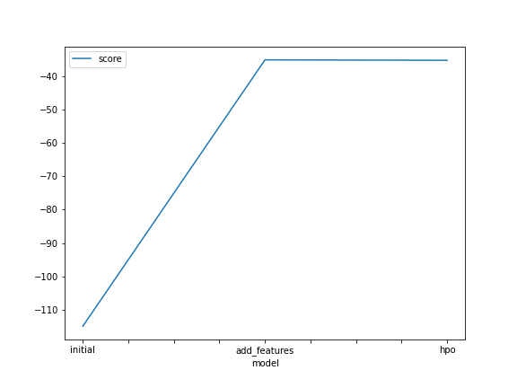
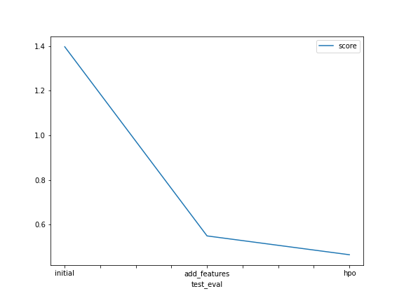

# Report: Predict Bike Sharing Demand with AutoGluon Solution
#### Cat Fritz

## Initial Training
### What did you realize when you tried to submit your predictions? What changes were needed to the output of the predictor to submit your results?
The predicted no. of bikes had to be zero or greater. Some predictions said to have a negative no. of bikes, so those predictions had to be updated to 0.

### What was the top ranked model that performed?
Weighted Ensemble L2

## Exploratory data analysis and feature creation
### What did the exploratory analysis find and how did you add additional features?
TODO: Add your explanation

### How much better did your model preform after adding additional features and why do you think that is?
It did more than 2x better after adding features. I added month, day, and hour since each feature could influence the demand. 

## Hyper parameter tuning
### How much better did your model preform after trying different hyper parameters?
It did slightly better after I adjusted the AutoGluon higher level parameters of bag folds, bag sets, and time limit.

### If you were given more time with this dataset, where do you think you would spend more time?
Understanding the hyper parameters for each model and tuning s.

### Create a table with the models you ran, the hyperparameters modified, and the kaggle score.
|model|num_bag_folds|num_bag_sets|time_limit|score|
|--|--|--|--|--|
|initial|0|0|600s|1.396
|add_features|0|0|600s|0.550
|hpo|5|2|900s|0.466

### Create a line plot showing the top model score for the three (or more) training runs during the project.

### Create a line plot showing the top kaggle score for the three (or more) prediction submissions during the project.

## Summary
The data did well with WeightedEnsemble_L3,WeightedEnsemble_L2, and ExtraTreesMSE_BAG_L2.
